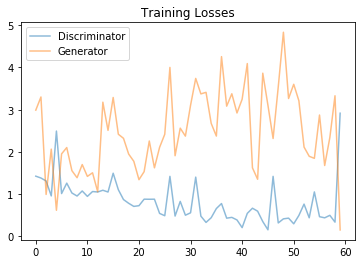
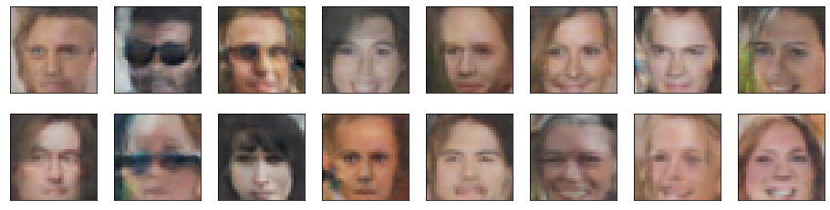

# GAN Face Generation

Implementation of the paper "Generative Adversarial Nets" applied to create fake faces

### Loss vs epochs

### Generated faces

## Contacts

If you want to keep updated with my latest articles and projects follow me on Medium. These are some of my contacts details:

1. [Personal Website](https://abhinavsagar.github.io/)
2. [Linkedin](https://in.linkedin.com/in/abhinavsagar4)
3. [Medium](https://medium.com/@abhinav.sagar)
4. [GitHub](https://github.com/abhinavsagar)
5. [Kaggle](https://www.kaggle.com/abhinavsagar)
